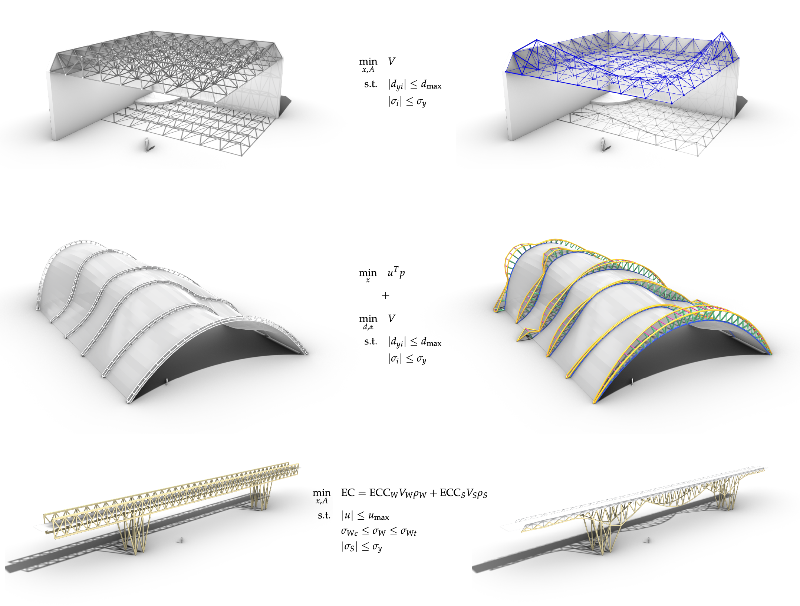
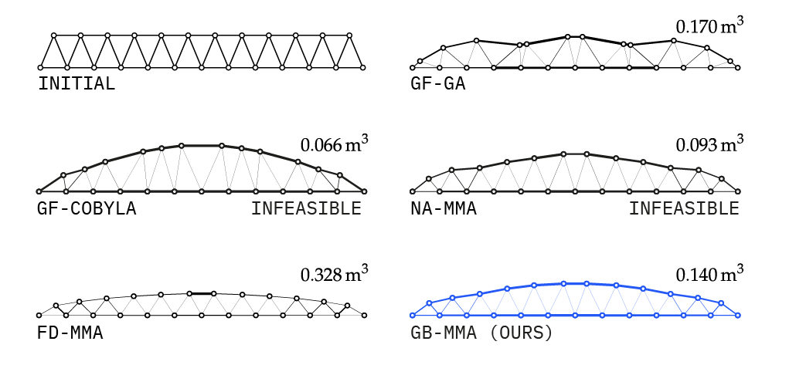
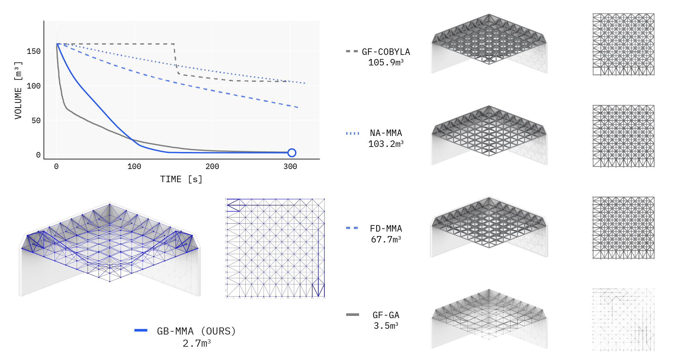
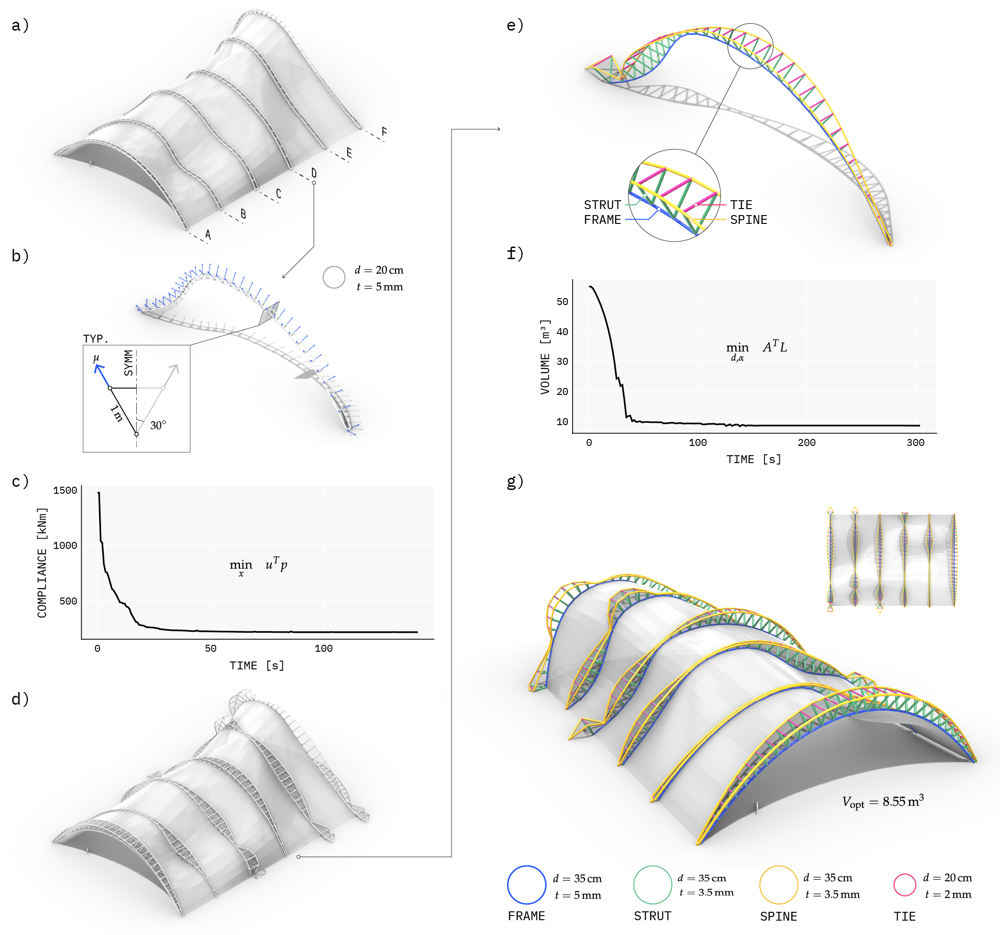
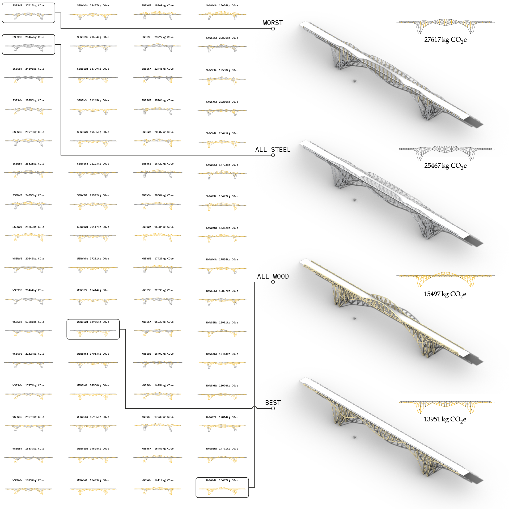

# Information
This is the complete repository for all work performed in the manuscript:  
*A differentiable structural analysis framework for high-performance design optimization*  

written by: Keith J. Lee, Yijiang Huang, and Caitlin T. Mueller  
and submitted to Automation in Construction (Elsevier)

# Abstract
Fast, gradient-based structural optimization has long been limited to a highly restricted subset of problems---namely, density-based compliance minimization---for which gradients can be analytically derived. 
For other objective functions, constraints, and design parameterizations, computing gradients has remained inaccessible, requiring the use of derivative-free algorithms that scale poorly with problem size.
This has restricted the applicability of optimization to abstracted and academic problems, and has limited the uptake of these potentially impactful methods in practice.
In this paper, we bridge the gap between computational efficiency and the freedom of problem formulation through a differentiable analysis framework designed for general structural optimization.
We achieve this through leveraging Automatic Differentiation (AD) to manage the complex computational graph of structural analysis programs, and implementing specific derivation rules for performance critical functions along this graph.
This paper provides a complete overview of gradient computation for arbitrary structural design objectives, identifies the barriers to their practical use, and derives key intermediate derivative operations that resolves these bottlenecks.
Our framework is then tested against a series of structural design problems of increasing complexity: two highly constrained minimum volume problem, a multi-stage shape and section design problem, and an embodied carbon minimization problem.
We benchmark our framework against other common optimization approaches, and show that our method outperforms others in terms of speed, stability, and solution quality.

# How to use this repository
## Install Julia
Download and install Julia, we recommend using [juliaup](https://github.com/JuliaLang/juliaup) to have better control over different versions. This codebase was written using v1.10.4.

### Recommended: Install Visual Studio Code
We recommend working with the files in this repository interactively, by sending code snippets to an active Julia REPL rather than running an entire file at a time.

Install [Visual Studio Code](https://code.visualstudio.com/) and the Julia language extension.

## Clone this repository
Using git or simply by downloading the entire codebase, make a local copy of this repository.

## Navigate to the repository and activate the environment
Navigate to your local version of this repository and start a Julia instance.  
Enter package mode by typing `]` in the REPL. If you see this:
```julia-repl
(DiffAnalysis_AIC2024) pkg>
```
you're ready for the next step. If you see this:
```julia-repl
(@v1.10) pkg>
```
run the following command:
```julia-repl
(@v1.10) pkg> activate .
```
to activate the current environment.

## Instantiate environment
Run:
```julia-repl
(DiffAnalysis_AIC2024) pkg> instantiate
```
to download and install all the dependencies in the versions used to create this paper. You are now ready to use the contents of this repository and run scripts to replicate our work.

# Repository organization
This repository is split into two primary folders: `src` and `paper-scripts`

## `src/`
`src` contains all necessary code to analyze and extract gradients of structural objectives/constraints, and contains all of our technical contributions discussed in the paper.

This folder is organized as a typical Julia package module, see `src/DiffAnalysis_AIC2024.jl` for the parent-level scope and overall organization.

### `src/Functions/`
This folder contains all code necessary to perform structural analysis and compute gradients. Our custom differentiation rules (pullbacks) are also defined in this section for performance critical functions.

### `src/Types/`
This folder contains data structures used to facilitate structural optimization problem formulations. This is an *implementation* of our framework, but is not discussed in the paper as an explicit contribution.

### Remaining folders
The remaining folders contain utility functions that facilitated the formulation, exploration, and visualization of the problems explored in this paper.

- `src/Generators/` contains useful parametric definitions of common structural typologies, such as the trusses seen in sections 4.1 and 4.2
- `src/IO/` contains input/output functions to export structural data as serialized .jsons for visualization as well as saving optimization data as .jld2 files
- `src/ObjectivesConstrains/` contains definitions of common objective functions and constraints
- `src/Optimization/` contains utility data structures to perform constrained/unconstrained optimization while saving relevant data and details
- `src/Utilities/` contains general utility functions
- `src/Visualization/` contains consistent themes/sizing to adhere to paper guidelines for font and figure sizes

## `paper-scripts/`
This folder contains all the code used to formulate and solve the optimization problems in this paper.

### `paper-scripts/S4.1_minvolume_warren/`

This folder contains the code used for Section 4.1: Constrained minimum volume optimization I.

Run `gb_mma.jl` to use our method to find the optimal combination of truss geometry and element areas that provide a minimum volume structure while meeting stress and displacement constraints.

After running all the other optimization combinations (e.g., `na_mma.jl`, `gf_ga.jl`) run `post_processing.jl` for a complete comparison.

### `paper-scripts/S4.2_minvolume_spaceframe/`

This folder contains the code used for Section 4.2: Constrained minimum volume optimization II.
It is structured similarly to the previous folder.

For the constructability-driven rationalized sizing approach in Section 4.2.1, run `gb_mma_3areas.jl`.

### `paper-scripts/S4.3_freeform_frame/`

This folder contains the code used for Section 4.3: Irregular frame design.

- `part1.jl` Performs the single-section sizing of the main frame structure (Section 4.3.1)
- `part2.jl` and `part3.jl` performs the unconstrained compliance optimization and the grouped sizing optimization (Section 4.3.2)


### `paper-scripts/S4.4_embodiedcarbon_bridge/`

This folder contains the code used for Section 4.4: Minimum embodied carbon design.

Run `sampler.jl` to iteratively perform all 64 optimization problems sequentially, saving all relevant data.
Note that this took 1 hour and 10 minutes on an M1 Pro Macbook Pro.